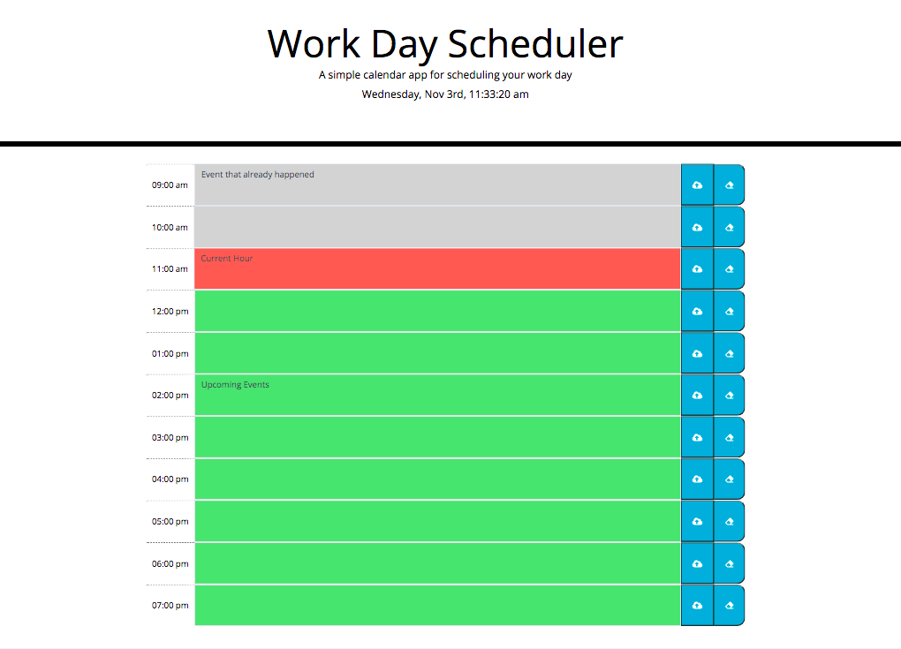

# Third-Party APIs: Work Day Scheduler

## Table of Contents

* [Description](#description)
* [Snippets](#snippets)
* [Technologies](#technologies)
* [Preview](#preview)
* [Links](#links)

## Description

This project consisted on creating a simple calendar application that allows a user to save events for each hour of the day. This website will feature HTML and CSS powered by JQuery.

## Snippets 

* **Bootstrap form and input classes**
```            
     <div class="row" id="r">
        <div class="input-group">
            <span class="input-group-text hour">09:00 am </span>
            <textarea class="form-control" aria-label="With textarea" id="9"></textarea>
            <button type="button" class="saveBtn" id="nin"><i class="fas fa-cloud-upload-alt"></i></button>
            <button type="button" class="clearBtn" id="nine"><i class="fas fa-eraser"></i></button>
        </div>
      </div>
```            

* **Save function using jQuery**

```          
save.forEach(item => {item.addEventListener("click", event => {
    for(var i=0; i< numbers2.length; i++)
    {
        if(event.target.id===numbers2[i]){
            var e = $("#"+(i+1)).val().trim();
            localStorage.setItem((i+1),JSON.stringify(e));
        }
    }

})
});  
```


* **Function when page is reloaded**
```            
$(window).on('load',function(){
    for(var i=0; i< numbers.length; i++){

        if(localStorage.getItem((i+1))!==""){
            $("#"+(i+1)).text(localStorage.getItem((i+1)));
        }  
    }
})
```   


## Technologies

* HTML
* CSS
* JavaScript
* Jquery 
* Moment.js
* Bootstrap

## Preview

This is a an image of the work day scheduler website in a computer view. 



This is a preview of the work day scheduler website in a cell phone view. 


## Links

* [URL of the deployed application](https://analuciarojas.github.io/challenge5/)

* [URL of the GitHub repository](https://github.com/analuciarojas/challenge5)